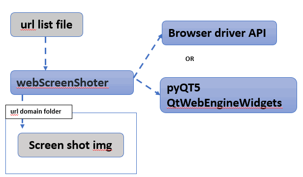
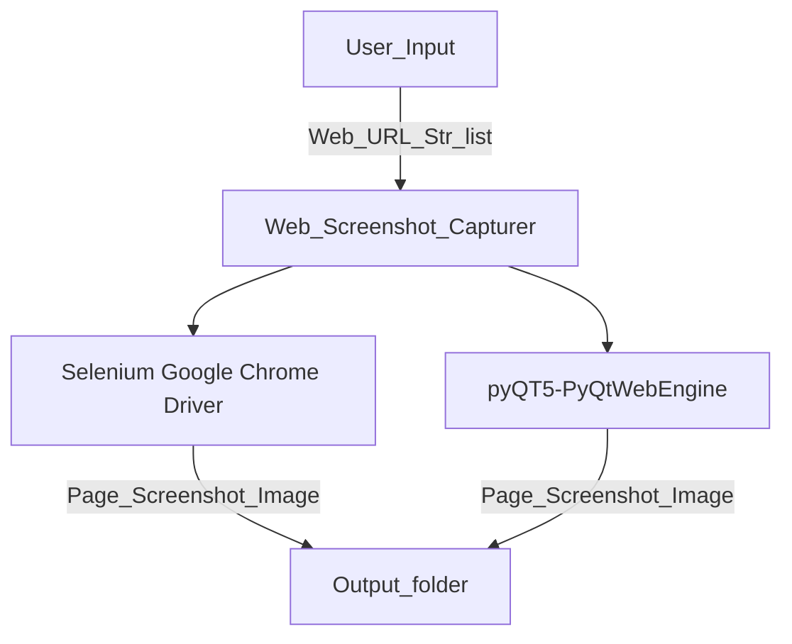
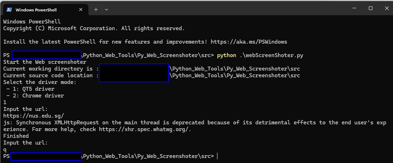

# Python Web Screenshot Tool

**Program Design Purpose**: Our objective is to develop a Python library for bigdata project's data collection purpose which can capture webpage screenshots in batches, based on a list of URLs, to support various programmatic use cases. The program workflow is depicted below:



` Figure-00: Python_web_screenshot_tool_program_workflow_diagram, version v0.1.2 (2024)`

The library utilizes two different web drivers, Selenium Google Chrome Driver and QT5 Web Engine, to capture webpage screenshots. It provide a flexible API that allows integration with other programs seamlessly.

```
# version:     v0.1.2
# Created:     2021/11/23
# Copyright:   Copyright (c) 2024 LiuYuancheng
# License:     MIT License
```

**Table of Contents**

[TOC]

- [Python Web Screenshot Tool](#python-web-screenshot-tool)
    + [Introduction](#introduction)
    + [Program Setup](#program-setup)
        * [Development Environment : Python 3.7.4](#development-environment---python-374)
        * [Additional Lib/Software Need](#additional-lib-software-need)
        * [Hardware Needed : None](#hardware-needed---none)
        * [Program Files List](#program-files-list)
    + [Program Usage](#program-usage)
      - [Program Execution](#program-execution)
      - [Module API Usage](#module-api-usage)
      - [Problem and Solution](#problem-and-solution)
        * [Problem: Fail to capture url screen shot under browser mode](#problem--fail-to-capture-url-screen-shot-under-browser-mode)
      - [Reference](#reference)

------

### Introduction

This module enables users to capture screenshots of either specific parts or entire webpages using different web browser drivers or the Qt5 library's QtWebEngineWidgets, based on the provided URL. Users can select the desired library for capturing webpages during object initialization by specifying the "driverMode" parameter. The module operates as a single-threaded program. The module Input and output flow is shown below:



To process multiple URLs simultaneously, users can list all the URLs they wish to capture in the "urllist.txt" file as demonstrated below (line start with char '#' will be treated as comments and ignored) :

```python
# Add the URL you want to download line by line(The url must start with 'http' or 'https' ):
# example: https://www.google.com
https://www.google.com
https://www.carousell.sg/
https://www.google.com/search?q=github&sxsrf=AOaemvJh3t5_h8H85AE8Ajbb1IMnBrRISA%3A1636698503535&source=hp&ei=hwmOYY6mHdGkqtsPq8S9sAY&iflsig=ALs-wAMAAAAAYY4Xl7GLWS16_xc2Q9XrG0p3q277DpkL&oq=&gs_lcp=Cgdnd3Mtd2l6EAEYADIHCCMQ6gIQJzIHCCMQ6gIQJzIHCCMQ6gIQJzIHCCMQ6gIQJzIHCCMQ6gIQJzIHCCMQ6gIQJzINCC4QxwEQowIQ6gIQJzIHCCMQ6gIQJzIHCCMQ6gIQJzIHCCMQ6gIQJ1AAWABgjgdoAXAAeACAAQCIAQCSAQCYAQCwAQo&sclient=gws-wiz
https://stackoverflow.com/questions/66022042/how-to-let-kubernetes-pod-run-a-local-script/66025424
```

Afterward, execute the test case program `testCase.py`, and the captured screenshots will be saved in the output folder `outputFolder`.


------

### Program Setup


##### Development Environment : Python 3.7.4

##### Additional Lib/Software Need

1. **Selenium**

   install: https://selenium-python.readthedocs.io/

   ```
   pip install selenium
   ```

2. **pyQT5** and **pyQT5-PyQtWebEngine**

   ```
   pip install PyQt5
   pip install PyQtWebEngine
   ```

   link: https://zetcode.com/pyqt/qwebengineview/

3. **Chrome browser driver**( optional, this lib need to work with selenium and fit your computer's browser version)

   link: https://chromedriver.chromium.org/downloads


##### Hardware Needed : None

##### Program Files List 

| Program File       | Execution Env | Description                                  |
| ------------------ | ------------- | -------------------------------------------- |
| webScreenShoter.py | python 3.7+   | Main executable program with the lib API.    |
| testCase.py        | python 3.7+   | Test case program and usage example.         |
| outputFile/*.png   |               | All the captured web page screen shot files. |
| urllist.txt        |               | url record list.                             |


------

### Program Usage


#### Program Execution 

Users have two options for executing the program: processing URLs individually or batch processing multiple URLs. All the screen shot image file will be saved in the output folder `outputFolder` under `shot_yymmdd_hhmmss.png` format. 

**Use Console Interface** 

To process URLs individually, users can run the program directly and follow the steps provided:

```
python webScreenShoter.py
```



` Figure-1: Python_web_screenshot_tool_execution, version v0.1.2 (2024)`

**Batches Process URL with Record File** 

1. Prepare a list of URLs to be processed by copying them into the URL record file "**urllist.txt**".

2. Navigate to the program folder and execute the program using the following command:

   ```
   python testCase.py
   ```

3. Check the results: for instance, if "https://www.carousell.sg/" is the first URL listed in "urllist.txt", the screenshot file **shot.png** will be saved in the folder "1_www.carousell.sg_files".


#### Module API Usage

WebScreenShoter Initialization: `obj = webScreenShoter()`

Calling API Method "getScreenShot()": Capture a screenshot of the webpage.

```
Check the Result: The webpage screenshot will be saved as a file named "shot.png" in the folder specified in the "getScreenShot()" function. If a browser driver is used for capture, the resolution of "shot.png" will be 1000x1000 pixels; otherwise, the entire webpage will be saved if QT5-WebEngine is used for capture.obj.getScreenShot(['<url>'], '<folder_name>')

# Exampe:
obj.getScreenShot(urlList, outputFolder, driverMode=MODE)
```

Check the result: The web screen shot will be saved as file "shot.png" in the folder you set in the function "getScreenShot()". If the user use browser driver to capture, the resolution of shot.png will be a 1000x1000, else  whole page will be saved if QT5-webengine is used for capture.


------

#### Problem and Solution

##### Problem: Fail to capture url screen shot under browser mode

**OS Platform** : Windows

**Error Message**: Driver version too old ...

**Type**: Setup exception

**Solution**:

1.Make sure the computer is connected to a screen and google-chrome browser is installed. 

2.Browser driver not match browser version, web response timeout, web browser blocks the risky webpage. Download the corrected version of driver from the driver download link. 

**Related Reference**:  https://chromedriver.chromium.org/downloads


------

#### Reference 

- https://pypi.org/project/webdriver-manager/
- https://zetcode.com/pyqt/qwebengineview/
- https://stackoverflow.com/questions/55231170/taking-a-screenshot-of-a-web-page-in-pyqt5
- https://stackoverflow.com/questions/51154871/python-3-7-0-no-module-named-pyqt5-qtwebenginewidgets


------

> Last edit by LiuYuancheng(liu_yuan_cheng@hotmail.com) at 03/05/2024, if you have any problem, please send me a message. 

