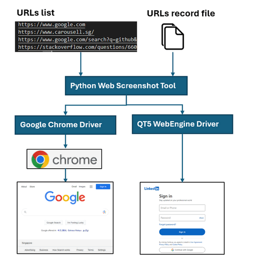

# Python Web Screenshot Tool

**Program Design Purpose**: 

Our objective is to develop a Python library for capturing webpage screenshots in batches, based on a list of URLs, to support various programmatic use cases. The program workflow is depicted below:



` Figure-00: Python_web_screenshot_tool_program_workflow_diagram, version v0.1.2 (2024)`

The library utilizes two different web drivers, Selenium Google Chrome Driver and QT5 Web Engine, to capture webpage screenshots. It provides a flexible API that allows integration with other programs seamlessly.

```
# version:     v0.1.2
# Created:     2021/11/23
# Copyright:   Copyright (c) 2024 LiuYuancheng
# License:     MIT License
```

[TOC]

------

### Introduction

This module will use different web browser's driver or Qt5 lib QtWebEngineWidgets to capture the part or the whole webpage's screen shot based on the given URL. The user can select the related lib he want to use to capture the webpage during the object init by passing in the "driverMode" parameter. The module is a single threading program.

To prosses multiple URLs at the same time, The user can list all the url he wants to download  in the file "urllist.txt" as shown below: 

```
# Add the URL you want to download line by line(The url must start with 'http' or 'https' ):
# example: https://www.google.com
https://www.google.com
https://www.carousell.sg/
https://www.google.com/search?q=github&sxsrf=AOaemvJh3t5_h8H85AE8Ajbb1IMnBrRISA%3A1636698503535&source=hp&ei=hwmOYY6mHdGkqtsPq8S9sAY&iflsig=ALs-wAMAAAAAYY4Xl7GLWS16_xc2Q9XrG0p3q277DpkL&oq=&gs_lcp=Cgdnd3Mtd2l6EAEYADIHCCMQ6gIQJzIHCCMQ6gIQJzIHCCMQ6gIQJzIHCCMQ6gIQJzIHCCMQ6gIQJzIHCCMQ6gIQJzINCC4QxwEQowIQ6gIQJzIHCCMQ6gIQJzIHCCMQ6gIQJzIHCCMQ6gIQJ1AAWABgjgdoAXAAeACAAQCIAQCSAQCYAQCwAQo&sclient=gws-wiz
https://stackoverflow.com/questions/66022042/how-to-let-kubernetes-pod-run-a-local-script/66025424
```

Then run the test case program `testCase.py`, then the screen shot will be save in the output folder `outputFolder`


------

### Program Setup


##### Development Environment : python 3.7.4

##### Additional Lib/Software Need

1. **selenium**

   install: https://selenium-python.readthedocs.io/

   ```
   pip install selenium
   ```

2. **pyQT5** and **pyQT5-PyQtWebEngine**

   ```
   pip install PyQt5
   pip install PyQtWebEngine
   ```

   link: https://zetcode.com/pyqt/qwebengineview/

3. **Chrome browser driver**( optional, this lib need to work with selenium and fit your computer's browser version)

   link: https://chromedriver.chromium.org/downloads

   


##### Hardware Needed : None

##### Program Files List 

| Program File       | Execution Env | Description                                  |
| ------------------ | ------------- | -------------------------------------------- |
| webScreenShoter.py | python 3.7+   | Main executable program with the lib API.    |
| testCase.py        | python 3.7+   | Test case program and usage example.         |
| outputFile/*.png   |               | All the captured web page screen shot files. |
| urllist.txt        |               | url record list.                             |


------

### Program Usage


#### Program Execution 

The user can run the program directly to process the url one by one or copy all the url strings in the url list file to batch process them.  All the screen shot will be save in the output folder `outputFolder` under `shot_yymmdd_hhmmss.png` format. 

**Use Console Interface** 

Run the program directly and follow the steps to process the url: 

```
python webScreenShoter.py
```


` Figure-1: Python_web_screenshot_tool_execution, version v0.1.2 (2024)`

**Batches Process** 

1. Copy the urls you want to check in the url record file "**urllist.txt**"

2. Cd to the program folder and run program execution cmd: 

   ```
   python testCase.py
   ```

3. Check the result: 

   For example, if you copy the url "https://www.carousell.sg/" as the first url you want to check into the file "urllist.txt" file, the screenshot file **shot.png** will be save under folder "1_www.carousell.sg_files"


#### Module API Usage

1. WebScreenShoter  Initialization : `obj = webScreenShoter()`

2. Call API method "getScreenShot()"  to capture the screen shot of the webpage.

   ```
   obj.getScreenShot(['<url>'], '<folder_name>')
   
   # Exampe:
   obj.getScreenShot(urlList, outputFolder, driverMode=MODE)
   ```

3. Check the result: The web screen shot will be saved as file "shot.png" in the folder you set in the function "getScreenShot()". If the user use browser driver to capture, the resolution of shot.png will be a 1000x1000, else  whole page will be saved if QT5-webengine is used for capture.

   

------

#### Problem and Solution

##### Problem: Fail to capture url screen shot under browser mode

**OS Platform** : Windows

**Error Message**: Driver version too old ...

**Type**: Setup exception

**Solution**:

1.Make sure the computer is connected to a screen and google-chrome browser is installed. 

2.Browser driver not match browser version, web response timeout, web browser blocks the risky webpage. Download the corrected version of driver from the driver download link. 

**Related Reference**:  https://chromedriver.chromium.org/downloads


------

#### Reference 

- https://pypi.org/project/webdriver-manager/
- https://zetcode.com/pyqt/qwebengineview/
- https://stackoverflow.com/questions/55231170/taking-a-screenshot-of-a-web-page-in-pyqt5
- https://stackoverflow.com/questions/51154871/python-3-7-0-no-module-named-pyqt5-qtwebenginewidgets


------

> Last edit by LiuYuancheng(liu_yuan_cheng@hotmail.com) at 03/05/2024, if you have any problem, please send me a message. 

